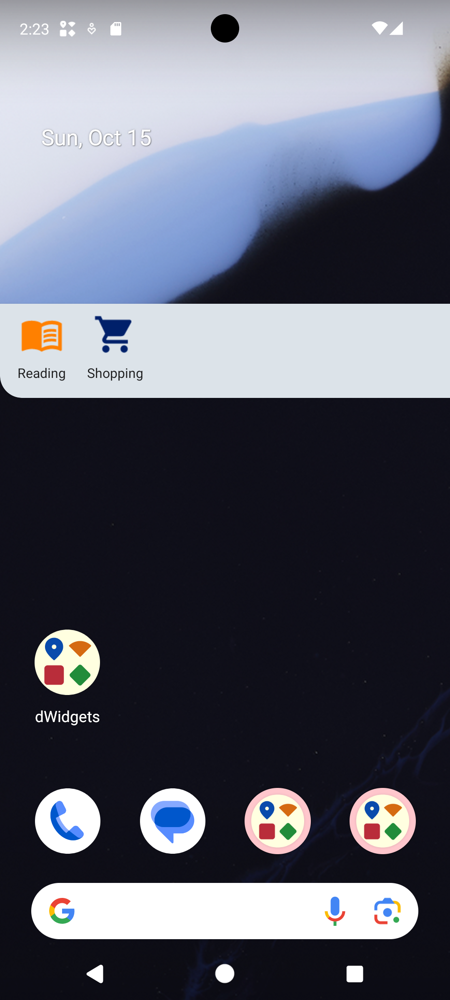
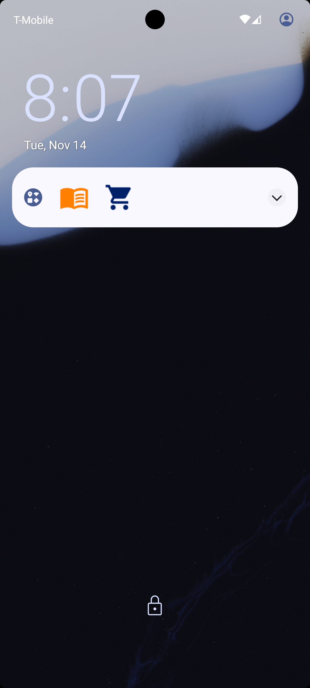

## Features

	
	

* It shows widgets on a [floating window](screenshots#widgets-on-the-floating-window) or the [notification panel](screenshots#widgets-on-the-notification-pannel). 
  Available widgets:
  - shortcut
  - displays a picture
* It automatically shows and hides widgets according to the conditions of your assigned rules. 
  Available conditions:
  - near the coordinate of a location
  - near a specific WiFi hotspot
* Various applications can be configured through different combinations of widgets and rules:
  - You can show a digital wallet shortcut when you are at a shopping center.
  - You can show a digital reader shortcut when you are at school.
* It also can display widgets on the [lockscreen](screenshots#widgets-on-the-notification-pannel)[^1].

[^1]: This feature is only supported on the devices that can display notifications on the lockscreen.